= Dossier d'Architecture Technique - Connaissance Client
:doctype: book
:revnumber: 1.0
:classification: C1 - Internal
:sectnumlevels: 4
:toclevels: 4
:sectnums: 4
:toc: left
:icons: font
:toc-title: Sommaire

Dernière modification : {docdate} 

Etat du document : *DRAFT*

== Historique des révisions

.Versions du document
[cols="1,2,3,5,2,3"]
|===
| #   | Date       | Auteur            | Description | Validation | Approbateur 
| 0.1 | 01/01/2021 | Philippe Bousquet | Création    |            |
|===

== Présentation Générale

=== Contexte Projet

Nous imaginons un nouveau projet permettant l'enregistrement des informations d'un client.

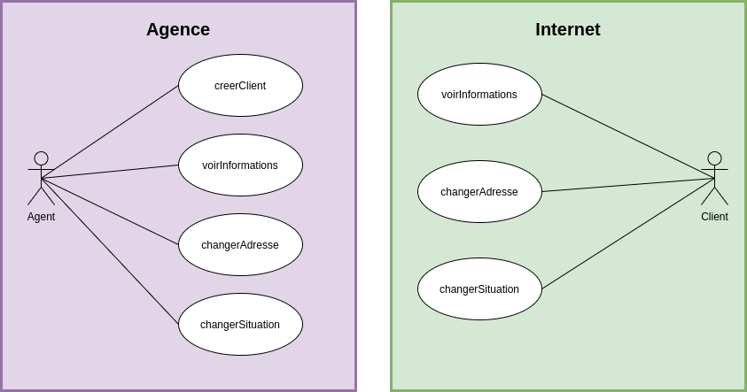

Nous avons donc deux situations, où nous pouvons manipuler les données client :

* Par l'Agent (ou conseiller) dans son agence
* Par le Client, au travers de son espace client sur internet

==== Approche Domain Driven Design 

L’approche DDD vise, dans un premier temps, à isoler un domaine métier. Un domaine métier riche comporte les caractéristiques suivantes:

* Il approfondit les règles métier spécifiques et il est en accord avec le modèle d’entreprise, avec la stratégie et les processus métier.
* Il doit être isolé des autres domaines métier et des autres couches de l’architecture de l’application.
* Le modèle doit être construit avec un couplage faible avec les autres couches de l’application.
* Il doit être une couche abstraite et assez séparée pour être facilement maintenue, testée et versionnée.
* Le modèle doit être conçu avec le moins de dépendances possibles avec une technologie ou un framework. 
* Le domaine métier ne doit pas comporter de détails d’implémentation de la persistance.

==== Le Domaine Connaissance Client

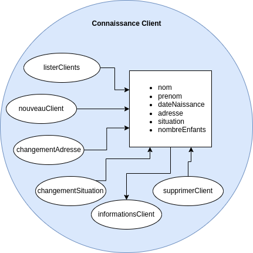

*Ici nous définissons :*

* Un modèle : c'est quoi un client ?
* Les uses cases métiers : quelles sont les opérations permises ?

*On ne se soucis pas du tout de l'aspect technique :*

* Comment je peux accéder à ces opérations dans le SI ?
* Où et comment sont stockées mes données ?

== Architecture Applicative

=== Architecture Générale

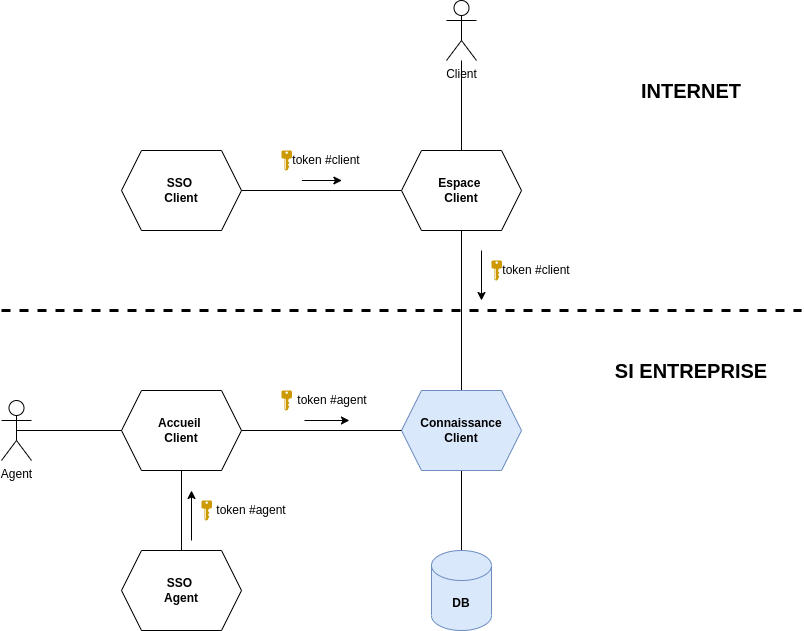

=== Architecture Hexagonale

L'architecture hexagonale repose sur trois principes et techniques:

* Séparer explicitement la logique métier de la partie exposition (client-side) et persistence (server-side).
* Les dépendances partent des couches techniques (client-side / server-side) vers la couche logique métier
* Il faut isoler les couches en utilisant des ports et des adaptateurs

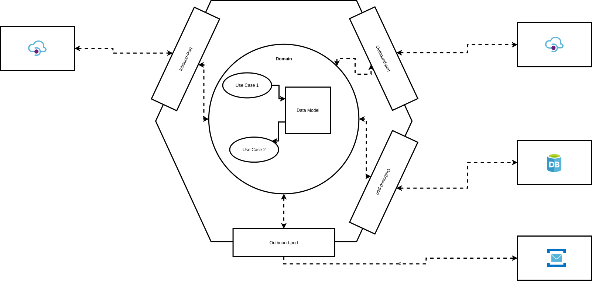

==== Découpage modulaire

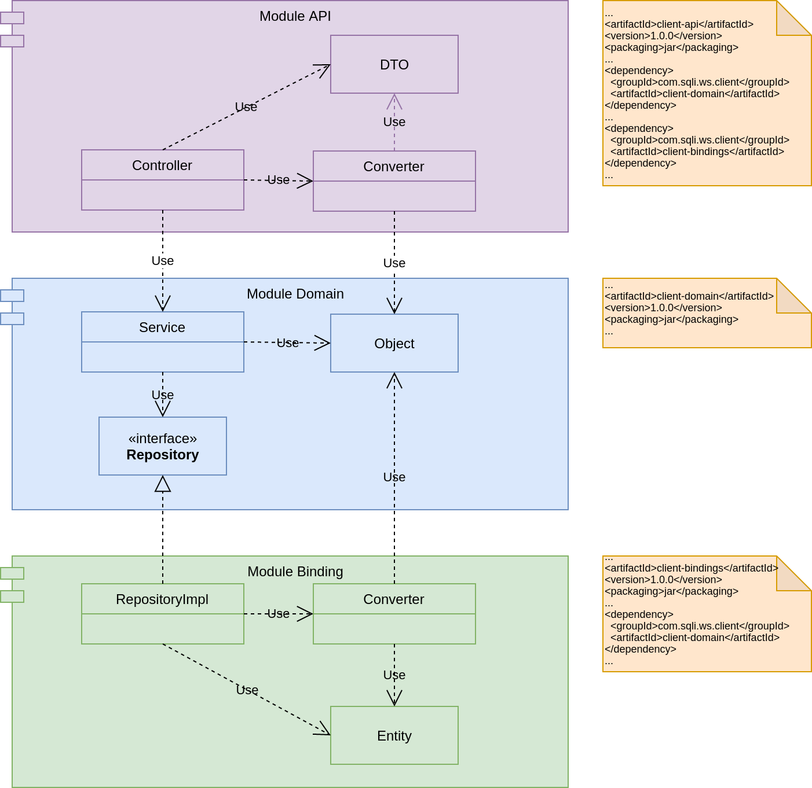

* Le _Binding_ *API* expose les APIs au front :
** Il y a une dépendence API -> Domaine (l'API voit le domaine, mais le domaine ne connait pas l'API) 
** Il effectue la conversion de l'Objet Métier vers le DTO renvoyé au front (Data Transfert Object) 
* Le _Domaine_ *Connaissance Client* implémente la logique métier
** Il travaile sur un Modèle métier
** Il n'a que la notion d'interface pour le repository (il va lire ou écrire un objet métier, mais il ne sait ni où ni comment)
* Le _Binding_ *Repository* va quant à lui gérer la partie technique de la persistence
** Il y a une dépendence Repository -> Domaine (le Repository voit le domaine, mais le domaine ne connait pas le Repository)
** Il effectue la conversion de l'Objet Métier vers l'Entity (et inversement)
** Il va persister et lire les données en base.

IMPORTANT: On note l'inversion de dépendance entre le Domaine et le Repository

==== Pile logiciellle

.Stack technique
[cols="3,3,6"]
|===
| Technologie | Version | Remarques
| OpenApi | 3.0 | Spécification pour le design et la documentation d'API REST
| Java | 11 | Langage de développement
| Maven | 3.6.x | Outil de build java
| openapi-generator-maven.version | 1.0.5 | Générateur de code à partir de spécifications OpenAPI (DesignFirst) 
| Spring-Boot | 2.3.6 | Accélérateur de développement d'application Spring
| spring-boot-starter-web | 2.3.6 | Couche MVC pour l'exposition des API
| spring-data-mongodb | 3.0.5 | Module JPA pour accès à BDD Mongo
| azure-spring-boot-starter-servicebus-jms | 3.2.0 | Module JMs pour accès au service bus
| Lombok | x.x | Utilitaire facilitant le développement de Java Beans
| Mapstruct | 1.0.3 | Framework de Mapping 
| Junit | 4.x | Framework pour les tests unitaires
| Mockito | 2.x | Framework pour le bouchonage lors de tests unitaires
|===

== Développement via l'approche TDD

* il s’agit d’une technique de conception où le programmeur écrit d’abord le test avant de produire le moindre code.
** Ecrire d’un test pour une fonctionnalité
** Le test est « failed »
** Codage de la fonctionnalité minimale
** Vérification du cas passant
** Répéter l’opération en enrichissant la fonctionnalité en refactorisant
* C’est une idée simple mais complexe à mettre en oeuvre.

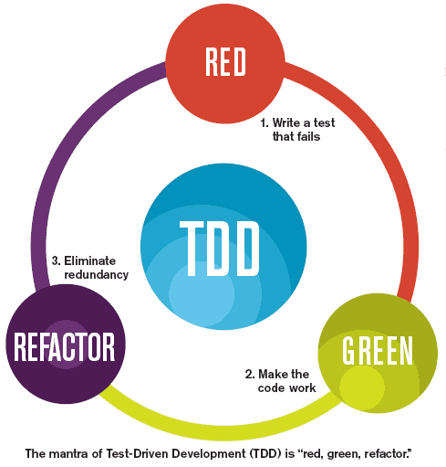

=== Domaine Connaissance Client

Module *connaissance-client-domain*

==== Classe de test *AdresseTest*

Elle permet de tester l'objet métier *Adresse*

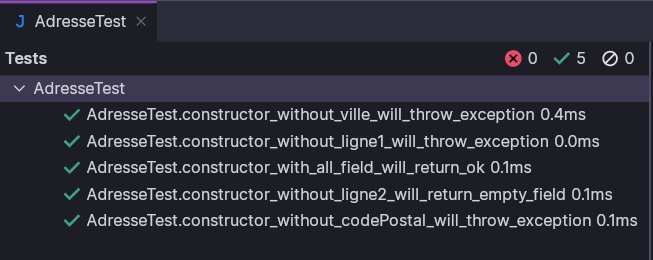

==== Classe de test *ConnaissanceClientTest*

Elle permet de tester l'objet métier *ConnaissanceClient*

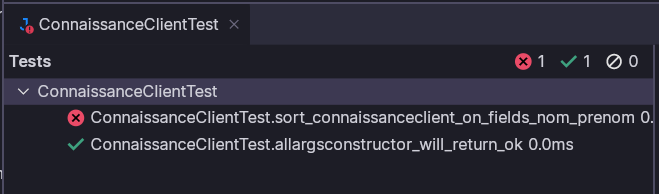

IMPORTANT: Corriger *ConnaissanceClient* pour que l'ensemble des tests soient passant

==== Classe de test *ConnaissanceClientServiceImplTest*

Elle permet de tester le service métier *ConnaissanceClientServiceImpl*

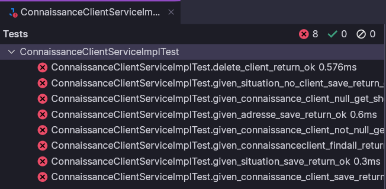

IMPORTANT: Corriger *ConnaissanceClientServiceImpl* pour que l'ensemble des tests soient passant

=== Le Module d'accès à la base de données

Module *connaissance-client-db-port*

==== Classe de test *ConnaissanceClientDbMapperTest*

Elle permet de tester le mapper *ConnaissanceClientDbMapper* permettant le transfert *ConnaissanceClient <=> ConnaissanceClientDb*

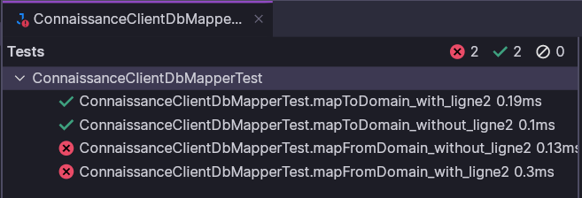

IMPORTANT: Corriger *ConnaissanceClientDbMapper* pour que l'ensemble des tests soient passant

==== Classe de test *ConnaissanceClientRepositoryImplTest*

Elle permet de tester le service d'acces à la DB *ConnaissanceClientRepositoryImpl*

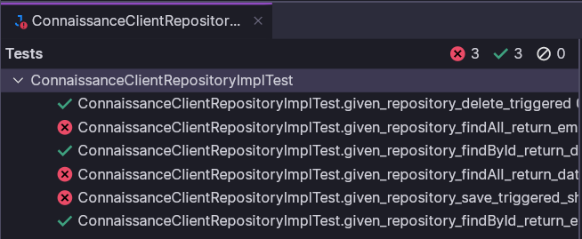

IMPORTANT: Corriger *ConnaissanceClientRepositoryImpl* pour que l'ensemble des tests soient passant

=== Le Module d'exposition API

Module *connaissance-client-api*

==== Classe de test *ConnaissanceClientDelegateTest*

Elle permet de tester l'implémentation API *ConnaissanceClientDelegate*

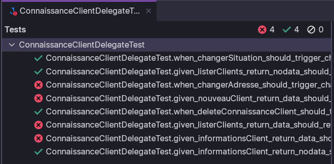

IMPORTANT: Corriger *ConnaissanceClientDelegate* pour que l'ensemble des tests soient passant

==== Classe de test *ConnaissanceClientApiIT*

Cette classe de test d'intégration permet de tester l'ensemble des couches de l'application

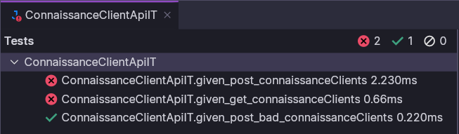

IMPORTANT: S'assurer que l'ensemble des tests soient passant

== Industrialisation

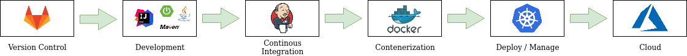

* Gestionnaire de Sources : Gitlab [Dev/Ops]
* Environnement de Développment : IDE, SpringBoot, Java, Env de test local [Dev]
* Plateforme d’Intégration Continue : Jenkins [Dev/Ops]	
* Solution de contenairization : Docker, Registry Privé [Dev/Ops]
* Solution de déploiement/management de containers : Kubernetes [Dev/Ops]
* Solution d'Hébergement Cloud : Azure	[Ops]

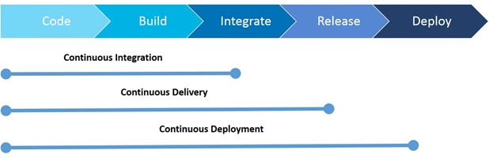

IMPORTANT: Viser le déploiement continue

== Infrastructure

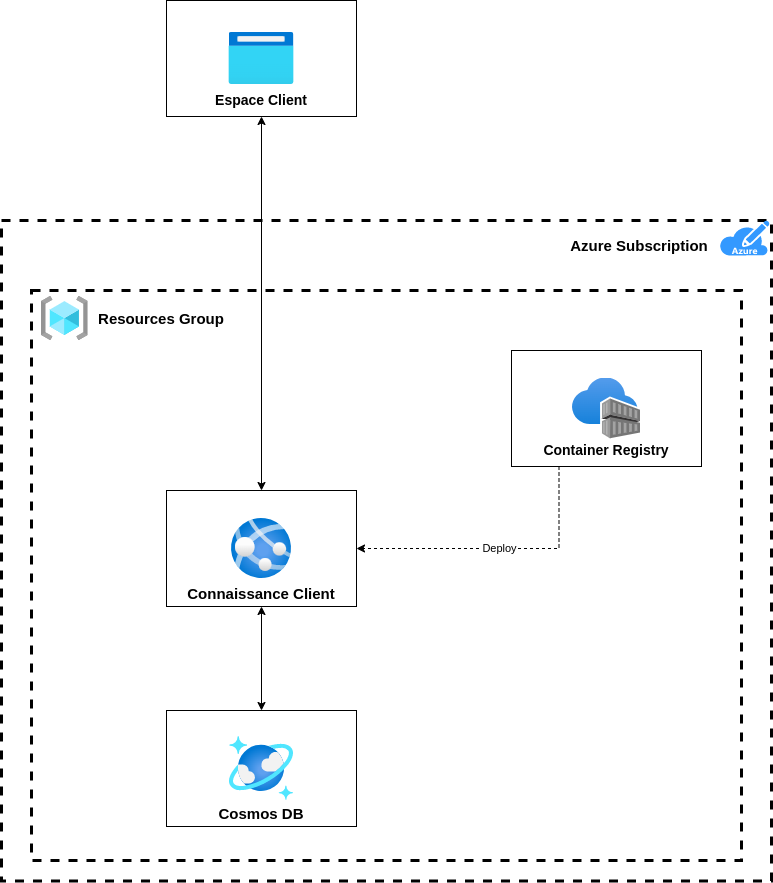

* Un Resource Group : pour regrouper l'ensemble de nos composants
* Un Azure Container Registry : Pour stocker nos images docker à déployer
* Un Cosmos DB : Pour stocker les données applicatives
* Un App Service : Pour héberger l'application Connaissance Client

=== Matrice des flux applicatifs

.Matrice de flux applicatifs
[cols='2,3,1,1']
|===
|Source|Destination|Protocole| Mode.footnote:[(L)ecture, (E)criture ou Lecture/Ecriture (LE), (A)ppel (vers un système stateless)]
| Internet | Connaissance Client | HTTP | A
| ConnaissanceClient | CosmosDB | TCP/IP | LE
|===

=== Environnements

Lister dans ce paragraphe les environnements nécessaires 

.Références documentaires
[cols="1,3,4"]
|===
| Environement | Date Souhaité | Objectif
| INT | 01/01/2021    | Environnement destiné à l'équipe de développement
| REC | 01/04/2021    | Environnement pour la recette Utilisateur
| PPROD | 01/06/2021  | Environnement de préproduction
| PROD | 01/07/2021   | Environnement de production
|===

== Performance et Sécurité

Ce projet étant un projet exemple il n'y a pas de contraites spécifique en matière de performance et de sécurité
